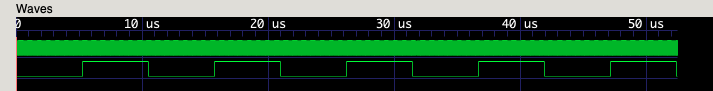

# Verilog LED Blinker

Simple Verilog program to blink an LED at a given frequency, using [verilator](https://verilator.org/guide/latest/overview.html) to sim + test.

GTKWave output:


## building/running

```sh
verilator -Wall --cc --exe --build -CFLAGS -DVL_TIME_STAMP64 -LDFLAGS -undefined -LDFLAGS dynamic_lookup --trace led_blink.v sim_led.cpp
./obj_dir/Vled_blink
```

